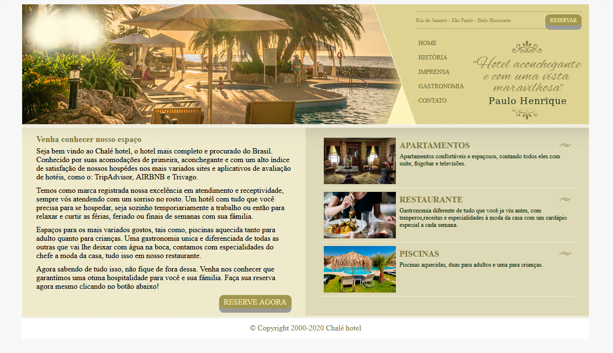

# ProjetoChale-Hotel
Design of a fictitious chale hotel, using HTML and pure CSS.

<h1 >
  
</h1>

<h1> Tecnologias </h1>

 The following tools were used in the construction of this project

- [HTML](https://www.w3schools.com/html/default.asp)
- [CSS](https://www.w3schools.com/css/default.asp)
